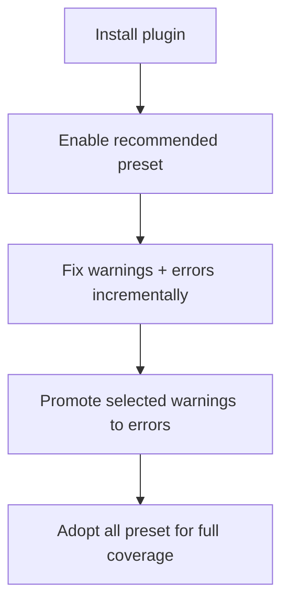

# Getting Started

Install the plugin:

```bash
npm install --save-dev eslint-plugin-etc-misc
```

Then enable it in your Flat Config:

```ts
import etcMisc from "eslint-plugin-etc-misc";

export default [etcMisc.configs.recommended];
```

## Recommended approach

- Start with `etcMisc.configs.minimal` if you want to defer readonly-style constraints.
- Start with `etcMisc.configs.recommended`.
- Fix violations in small batches.
- Move to `etcMisc.configs.all` when you want every available rule enabled.

## Rollout flow



## Migration guide

If your project currently uses `eslint-plugin-etc` and/or
`eslint-plugin-misc` directly, use this migration playbook:

- [Migration from `eslint-plugin-etc` and `eslint-plugin-misc`](./guides/migration-from-etc-and-misc.md)

## Rule navigation

Use the sidebar **Rules** section for the full list of rule docs synced from the repository.
