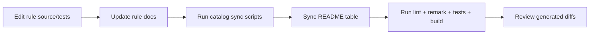

# Docs maintenance playbook

Use this guide whenever you add, remove, rename, or deprecate rules.

## Goal

Keep code, rule docs, presets docs, and README tables synchronized in one pass.

## Recommended update pipeline



## Command checklist

Run from repository root:

```bash
node scripts/sync-rule-catalog-ids.mjs
node scripts/sync-readme-rules-table.mjs --write
npm run lint
npm test
npm run build
npm run remark:check
```

## High-signal review checks

- Rule doc includes correct rule ID, examples, and fix/suggestion behavior.
- Preset pages reference correct rule catalog IDs.
- README rules table reflects current metadata and preset membership.
- New docs pages are discoverable through site sidebar navigation.

## Common failure modes

- Stale README rules table after adding a new rule.
- Missing ADR/docs rationale for a policy-level preset change.
- Renumbered catalog IDs not reflected in preset docs.
