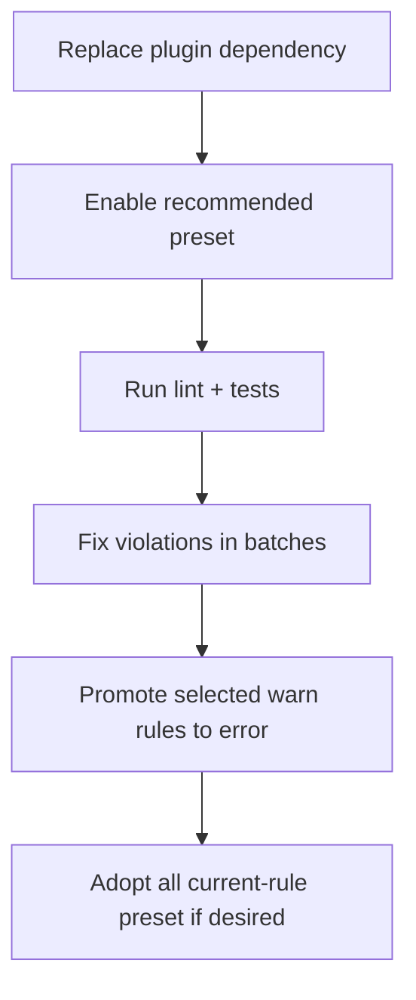

# Migration from `eslint-plugin-etc` and `eslint-plugin-misc`

This guide helps you migrate from separate plugin usage to
`eslint-plugin-etc-misc` with minimal disruption.

## Why migrate

- Single package install and versioning strategy.
- One namespace (`etc-misc/*`) for rule configuration.
- Curated presets with documented deprecations and replacements.

## Migration steps

### 1) Install the unified plugin

```bash
npm install --save-dev eslint-plugin-etc-misc
```

### 2) Replace plugin imports in flat config

Before:

```ts
import etc from "eslint-plugin-etc";
import misc from "eslint-plugin-misc";

export default [
 {
  plugins: { etc, misc },
  rules: {
   "etc/no-internal": "error",
   "misc/no-t": "error",
  },
 },
];
```

After:

```ts
import etcMisc from "eslint-plugin-etc-misc";

export default [etcMisc.configs.recommended];
```

### 3) Update namespaced rule IDs (if manually configured)

- `etc/<rule>` and `misc/<rule>` become `etc-misc/<rule>`.
- For TypeScript-scoped rules, use `etc-misc/typescript/<rule>`.

### 4) Validate and tune severities

Run your quality gate, then adjust severities as needed:

```bash
npm run lint
npm test
```

## Suggested migration flow



## Common migration notes

- Some legacy rules are intentionally deprecated in this plugin and include
  replacement guidance in docs.
- Normal presets, including `all` and `allStrict`, exclude deprecated rules.
  Use a deprecated-inclusive exhaustive preset only as a temporary migration
  bridge.
- If you previously maintained a heavily custom rule list, start from
  `recommended`, then layer explicit overrides.

## Verification checklist

- [ ] No references to `etc/` or `misc/` namespaces remain in config.
- [ ] `eslint-plugin-etc-misc` is the active plugin in your lint pipeline.
- [ ] CI passes with updated lint and test baselines.
