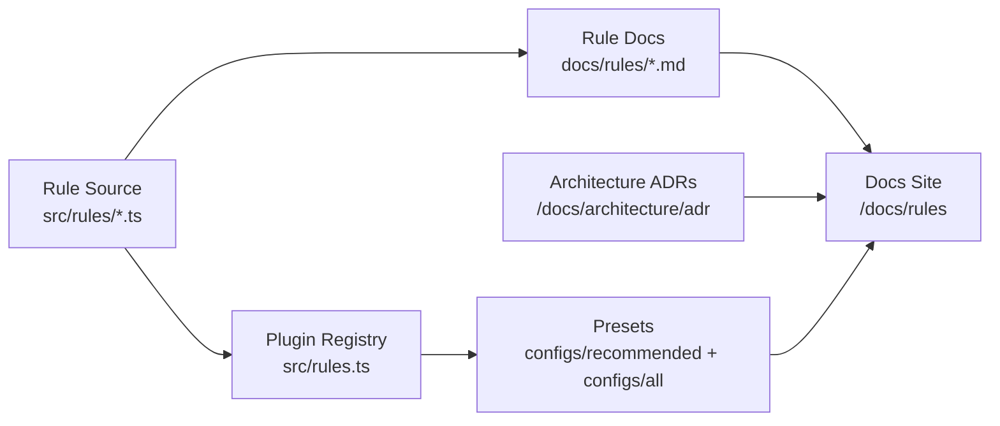

# eslint-plugin-etc-misc

`eslint-plugin-etc-misc` combines rules from `eslint-plugin-etc` and
`eslint-plugin-misc` into one Flat Config-ready plugin for modern TypeScript
projects.

## What this documentation includes

- A complete **rule reference** with examples for every rule.
- **Getting Started** guidance for Flat Config projects and preset adoption.
- **Architecture** notes and ADRs explaining key documentation and design decisions.
- A small **Developer API** section generated with TypeDoc.

## Architecture at a glance

## Recommended reading path

1. Start with **Getting Started** to enable the plugin quickly.
2. Open **Guides** for rollout, migration, and docs-maintenance workflows.
3. Review **Architecture ADRs** to understand why key decisions were made.
4. Use the full **Rules** reference for day-to-day rule adoption.

## Next step

Next, open the **Getting Started** page in the sidebar to enable the plugin in your project.
